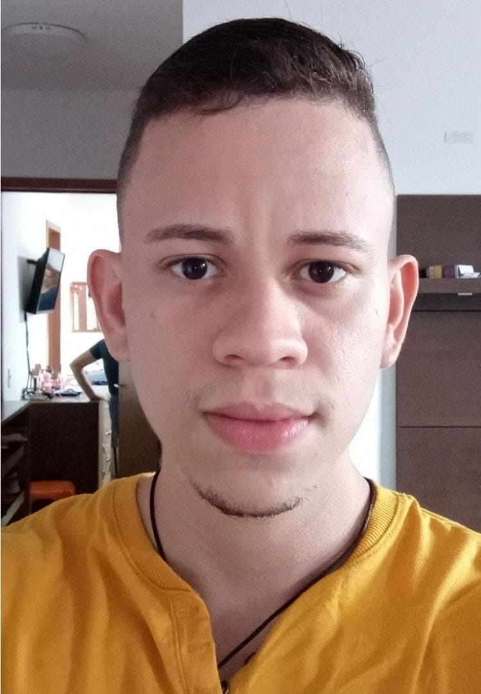

# Início

## 1. Sobre o Projeto
Repositório destinado ao desenvolvimento do trabalho da disciplina Requisitos de Software na Universidade de Brasília - Faculdade do Gama (UnB - FGA). Nesse repositório será possível encontrar as etapas e processos desenvolvidos para a entrega final do projeto desejado. O aplicativo que será base do projeto é o **Youtube**.

## 2. Sobre o Youtube

Youtube é uma plataforma que permite a criação e postagem de vídeos de diversos gêneros em canais. Esses vídeos podem ser assistidos, curtidos, comentados e compartilhados por usuários que podem, também, se inscreverem nos canais. O aplicativo possui mais de 3.7 milhões de avaliações na Apple Store em junho/2022 e é amplamente conhecido e usado no mundo todo.

## 2. Equipe
<table>
  <tr>
    <td align="center">
      <a href="#">
         
        
          <b>Carlos Godoy (@CDGodoy)</b>
        
      </a>
    </td>
    <td align="center">
      <a href="#">
         
        
          <b>Felipe Alef (@Alef012)</b>
        
      </a>
    </td>
    <td align="center">
      <a href="#">
         
        
          <b>Lucas Ramon (@lramon2001)</b>
        
      </a>
    </td>
    <td align="center">
      <a href="#">
         
        
          <b>Paulo Henrique Almeida (@owhenrique)</b>
        
      </a>
    </td>
    <td align="center">
      <a href="#">
         
        
          <b>Pedro Victor (@B3holder2)</b>
        
      </a>
    </td>
    <td align="center">
      <a href="#">
         
        
          <b>Victor Leão (@victorleaoo)</b>
        
      </a>
    </td> 
</table>

## 3. Histórico de Versão
| Versão | Data | Descrição | Autor(es) |
| ------ | ---- | --------- | --------- |
| 1.0    | 23/06/2002 | Criação da primeira versão do documento com uma descrição do repositório e da equipe | @victorleaoo |
| 1.1    | 28/06/2002 | Definição do app e sua descrição | @victorleaoo, @owhenrique, @B3holder2, @lramon2001, @Alef012, @CDGodoy |